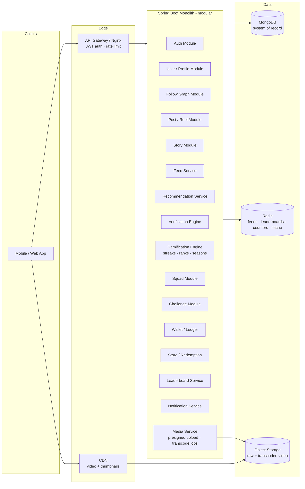
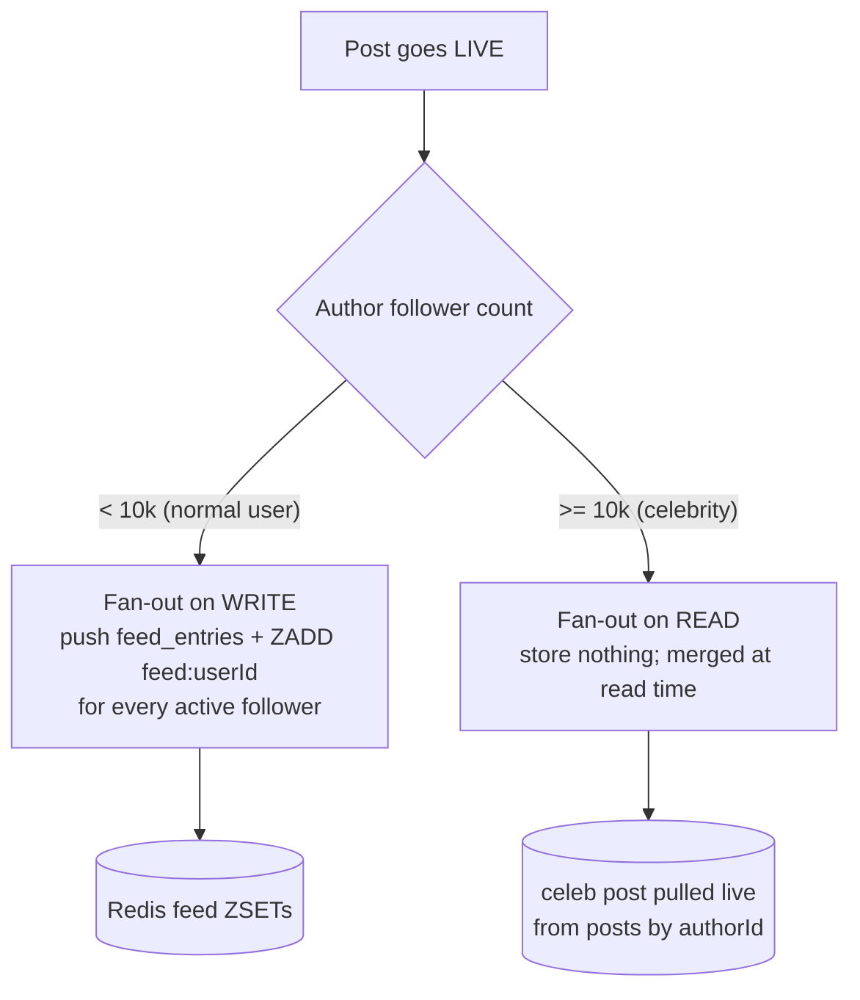
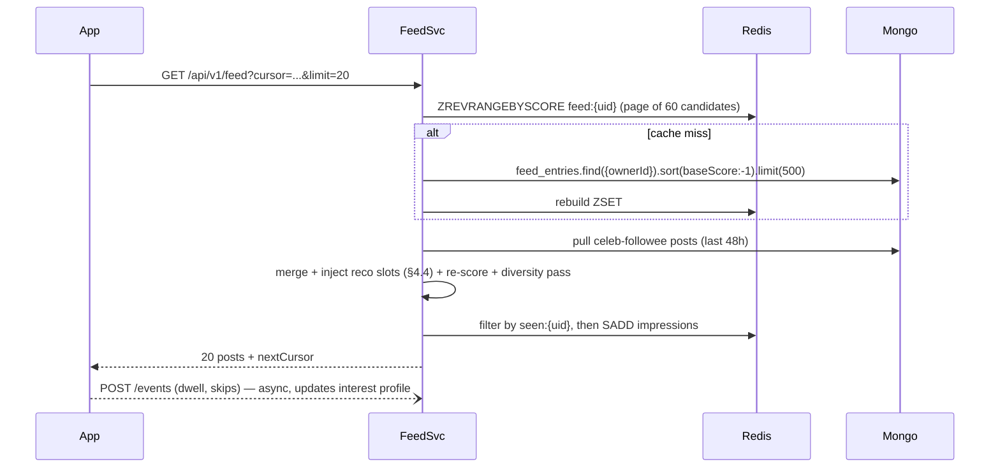
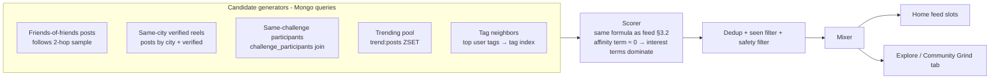
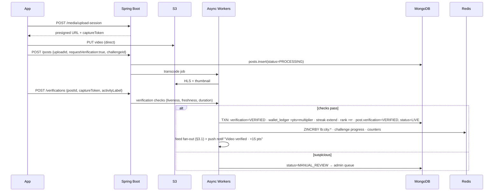
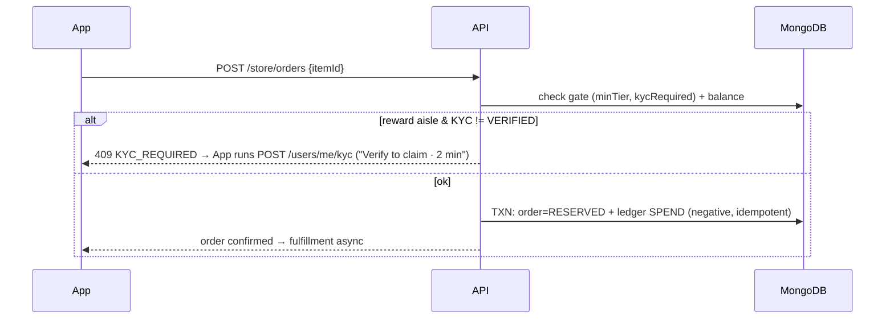

# MEHNAT — Backend Architecture (Phase 1)

**Stack:** Java 21 · Spring Boot · MongoDB (primary) · Redis (feed/cache/leaderboards) · S3-compatible object storage (video)
**Design source:** MEHNAT v2 (verified-video reels, streaks, squads, ranked ladder, challenges, points wallet, effort store, city leaderboards)
**Phase 1 constraint:** feed + recommendations are **DB-driven** (no ML infra). Everything computable with Mongo aggregations + Redis sorted sets.

---

## 1. System Overview



Phase 1 ships as a **modular monolith** (one deployable, package-per-module under `com.bsn.backend`). Module boundaries above are the future microservice split lines — no code change needed later except extraction.

**Core principle from the design:** *"Points move only when you record."* Every point, streak day, rank change, and leaderboard entry traces back to a `verification` record of a video. The Wallet is append-only; nothing mutates balances directly.

---

## 2. Data Architecture

### 2.1 Storage responsibilities

| Store | Role | Data |
|---|---|---|
| **MongoDB** | System of record | users, profiles, follow graph, posts/reels, stories, comments, likes, engagement events, interest profiles, verifications, streaks, squads, challenges, wallet ledger, store, redemptions, seasons, notifications, precomputed feed entries |
| **Redis** | Hot path | home-feed cache (ZSET), stories tray, leaderboards (ZSET), counters (likes/views), trending sets, rate limits, streak-deadline queue |
| **Object storage + CDN** | Blobs | raw uploads, transcoded renditions (HLS), thumbnails, flex cards |

Phase 2+ additions (not built now, but schema is compatible): Kafka for the event bus, Elasticsearch for search, a feature store + ML ranker replacing the DB scoring formula.

### 2.2 MongoDB collections

Conventions: `_id` is `ObjectId` unless stated; all docs carry `createdAt`/`updatedAt`; monetary-like values (points) are **integers**; every collection lists its required indexes — they are part of the design, not an afterthought.

#### users — identity & auth (extends existing `User` model)
```js
{
  _id, handle: "rohit_lifts",          // unique, immutable after 1 change
  email, phone, passwordHash,
  status: "ACTIVE" | "SUSPENDED" | "DELETED",
  roles: ["USER"],
  kyc: { status: "NONE"|"PENDING"|"VERIFIED", verifiedAt, provider },
  deviceTokens: [ { token, platform, lastSeenAt } ],
  createdAt, lastLoginAt
}
// idx: {handle:1} unique, {email:1} unique, {phone:1} unique sparse
```

#### user_profiles — public profile + denormalized stats (user profiling, read-optimized)
```js
{
  _id: userId,                          // 1:1 with users
  displayName, bio, avatarUrl, city: "Chamba", cityGeo: {type:"Point", coordinates:[lng,lat]},
  memberSince: "S1",
  isVerifiedHuman: true,                // set after first successful video verification + liveness
  privacy: { isPrivate: false, showCity: true },
  stats: {                              // denormalized counters, updated by events
    followers: 0, following: 0, posts: 0,
    verifiedDays: 148, verifiedEffortHours: 148,
    challengesDone: 12, currentStreak: 23, longestStreak: 41
  },
  rank: { tier: "IMMORTAL", rr: 137, multiplier: 1.6, season: "S2", heldSince },
  shareSlug: "rohit"                    // mehnat.app/r/rohit  (QR verify link)
}
// idx: {city:1, "rank.rr":-1}, {shareSlug:1} unique, {cityGeo:"2dsphere"}
```

#### user_interest_profile — the DB-native "user embedding" for recommendations
```js
{
  _id: userId,
  tags: { "gym": 0.82, "running": 0.41, "yoga": 0.05, ... },   // decayed affinity weights
  creators: { "<creatorId>": 0.9, ... },                        // top-50 creator affinities
  activeHours: [5,6,7,19,20],                                   // posting/consumption hours
  city: "Chamba",
  lastRecomputedAt
}
// idx: none beyond _id (always fetched by user). Recomputed by nightly job + incremental updates.
```

#### follows — follow graph (edge collection, two-way queryable)
```js
{ _id, followerId, followeeId, state: "ACTIVE"|"REQUESTED", createdAt }
// idx: {followerId:1, followeeId:1} unique, {followeeId:1, createdAt:-1}
```
Fetch "who do I follow" and "who follows me" from the same collection. Counts live in `user_profiles.stats`, incremented transactionally with edge writes.

#### posts — reels & posts (the only content type that earns points is a *verified* reel)
```js
{
  _id, authorId, type: "REEL" | "PHOTO",
  caption, tags: ["gym","challenge:fitzone30"],
  media: { rawKey, hlsUrl, thumbUrl, durationSec, width, height },
  verification: {                       // null for casual posts
    status: "PENDING"|"VERIFIED"|"REJECTED",
    verificationId, verifiedAt, day: 27 // "Day 27" badge in UI
  },
  challengeId: null | ObjectId,         // posted into a challenge
  squadId: null | ObjectId,
  visibility: "PUBLIC"|"FOLLOWERS",
  counts: { likes: 0, comments: 0, views: 0, shares: 0 },  // eventually-consistent mirror of Redis
  score: { velocity: 0.0, updatedAt },  // engagement velocity for ranking (job-updated)
  status: "LIVE"|"PROCESSING"|"REMOVED",
  createdAt
}
// idx: {authorId:1, createdAt:-1}, {challengeId:1, createdAt:-1},
//      {tags:1, createdAt:-1}, {"verification.status":1, createdAt:-1},
//      {"score.velocity":-1, createdAt:-1}   // trending candidates
```

#### stories — 24h ephemeral content
```js
{
  _id, authorId,
  media: { url, thumbUrl, durationSec, type: "VIDEO"|"IMAGE" },
  isVerifiedClip: false,                // a story cut from a verified reel gets the ✔ ring
  viewers: null,                        // views tracked in story_views, not embedded
  createdAt,
  expiresAt                             // createdAt + 24h
}
// idx: {authorId:1, createdAt:-1}, TTL index on {expiresAt:1} expireAfterSeconds:0
```

#### story_views
```js
{ _id, storyId, viewerId, viewedAt }
// idx: {storyId:1, viewerId:1} unique, {viewerId:1, viewedAt:-1}, TTL 48h
```

#### comments
```js
{ _id, postId, authorId, parentId: null|ObjectId, text, counts:{likes:0}, status, createdAt }
// idx: {postId:1, createdAt:-1}, {parentId:1, createdAt:1}
```

#### likes — one doc per like (idempotency + unlike + "liked by you")
```js
{ _id, subjectType: "POST"|"COMMENT"|"STORY", subjectId, userId, createdAt }
// idx: {subjectType:1, subjectId:1, userId:1} unique, {userId:1, createdAt:-1}
```

#### engagement_events — raw signal firehose (feeds the interest profile & velocity)
```js
{
  _id, userId, postId, authorId,
  type: "VIEW"|"COMPLETE_VIEW"|"LIKE"|"COMMENT"|"SHARE"|"JOIN_CLICK"|"SKIP"|"REPORT",
  dwellMs, tags: ["gym"], source: "FEED"|"EXPLORE"|"PROFILE"|"CHALLENGE",
  createdAt
}
// idx: {userId:1, createdAt:-1}, {postId:1, type:1}, TTL 90 days
```
Written fire-and-forget (async). This is the Phase 1 replacement for a Kafka event stream — same events, stored in Mongo, consumed by scheduled jobs.

#### feed_entries — precomputed home feed (fan-out-on-write target)
```js
{
  _id, ownerId,                         // whose feed this row belongs to
  postId, authorId,
  baseScore,                            // computed at fan-out time
  reason: "FOLLOWING"|"SQUAD"|"CHALLENGE"|"RECO"|"TRENDING",
  createdAt
}
// idx: {ownerId:1, baseScore:-1}, {ownerId:1, postId:1} unique,
//      {postId:1} (for delete fan-out), TTL 14 days
```
Capped at ~500 entries per user (job trims). Redis holds the hot mirror; Mongo is the durable copy so a Redis flush never loses feeds.

#### verifications — the heart of MEHNAT ("every number was earned on camera")
```js
{
  _id, userId, postId,
  method: "AUTO"|"MANUAL_REVIEW"|"PEER",
  checks: {
    liveness: true, faceMatch: true,     // Phase 1: liveness via client SDK + heuristics
    durationOk: true, freshRecording: true, // EXIF/capture-token proves in-app camera, not gallery
    activityLabel: "gym"                 // Phase 1: user-declared + heuristic; Phase 2: model
  },
  status: "PENDING"|"VERIFIED"|"REJECTED",
  reviewerId: null, rejectReason: null,
  effortSeconds: 3600,
  pointsAwarded: 15, multiplierApplied: 1.6,
  localDate: "2026-07-04", tz: "Asia/Kolkata",  // for streak day-bucketing
  createdAt, decidedAt
}
// idx: {userId:1, localDate:1} unique partial(status:"VERIFIED"),  // ONE verified video/day counts
//      {status:1, createdAt:1} (review queue), {postId:1} unique
```

#### streaks
```js
{
  _id: userId,
  current: 23, longest: 41, lastVerifiedLocalDate: "2026-07-04",
  freezesAvailable: 2, freezesUsed: [ { date, source: "CHALLENGE_FITZONE" } ],
  heatmap: { "2026-06": "1101111...", "2026-07": "1111" },  // bitmap string per month, 13-week UI reads last 4
  graceDeadlineAt                       // next 00:00 local + grace; drives the decay warning
}
// idx: {graceDeadlineAt:1} — the streak-tick job scans this
```

#### squads — small accountability groups ("Subah 5 Baje")
```js
{
  _id, name: "Subah 5 Baje", ownerId,
  memberIds: [userId],                   // hard cap ~8, embedded is fine
  streak: { current: 23, lastCompleteLocalDate },
  rule: "ALL_MUST_RECORD",               // squad streak resets to 0 if anyone misses
  theme: "default", themeUnlocks: ["gold_ember"],
  wallet: { pts: 0 },                    // squad-level points if used
  createdAt
}
// idx: {memberIds:1}
```

#### squad_daily_status — per-day member completion (drives "Arjun pending · 6h left")
```js
{ _id, squadId, localDate, done: [userId], pending: [userId], resolvedAt }
// idx: {squadId:1, localDate:-1} unique
```

#### challenges — sponsored/community challenges (FitZone 30-day)
```js
{
  _id, slug: "fitzone-30", sponsor: "FitZone",
  title, description, city: null|"Chamba",
  durationDays: 30, startAt, endAt,
  maxPoints: 1000,
  payoutCurve: [ {fromDay:1, toDay:7, ptsPerDay:5}, {fromDay:8, toDay:20, ptsPerDay:15},
                 {fromDay:21, toDay:30, ptsPerDay:44} ],   // "77% of value in the final stretch"
  rules: { videosPerDay: 1, freezesIncluded: 2, quitPenaltyPts: 50 },
  friendBonus: { threshold: 3, bonusPts: 100 },
  stats: { joined: 2314, finished: 0, finishRate: 0.18 },
  status: "UPCOMING"|"ACTIVE"|"ENDED"
}
// idx: {slug:1} unique, {status:1, city:1, startAt:-1}
```

#### challenge_participants
```js
{
  _id, challengeId, userId, joinedAt,
  progress: { day: 27, verifiedDays: [1,2,3,...], freezesLeft: 1 },
  friendsJoined: [userId],
  state: "ACTIVE"|"FINISHED"|"QUIT"|"FAILED",
  pointsEarned: 412, finishedAt
}
// idx: {challengeId:1, userId:1} unique, {userId:1, state:1}, {challengeId:1, "progress.day":-1}
```

#### seasons & season_ranks — the ladder
```js
// seasons
{ _id: "S2", startAt, endAt, softResetRules: { tierDrop: 2, rrFloor: 40 } }

// season_ranks (one per user per season — the "season shelf" collection)
{
  _id, userId, seasonId: "S2",
  tier: "IMMORTAL", rr: 137, multiplier: 1.6,
  peakTier, heldDays: 41, longestGapDays: 1,
  holdRequirements: { rrAbove100: true, noThreeDayGaps: true, challengesDone: 1, challengesRequired: 2 },
  decay: { startsAt, active: false },    // "no video in 3 days → decay starts in 4 days"
  history: [ { at, deltaRr, reason: "VERIFIED_VIDEO"|"DECAY"|"CHALLENGE_FINISH" } ]  // capped 100
}
// idx: {userId:1, seasonId:1} unique, {seasonId:1, rr:-1}
```

#### wallet_ledger — append-only, double-entry-ish; balance is a fold
```js
{
  _id, userId,
  delta: +15,                            // negative for spends
  balanceAfter: 2451,                    // written under a per-user transaction
  kind: "EARN_VERIFIED"|"EARN_CHALLENGE"|"EARN_BONUS"|"SPEND_COSMETIC"|"SPEND_REWARD"|"PENALTY_QUIT"|"MATURE",
  refType: "verification"|"challenge"|"store_order", refId,
  maturity: { maturesAt, matured: false }, // "+180 maturing in 4 days" — challenge payouts vest
  idempotencyKey,                        // e.g. "verif:<verificationId>" — prevents double-award
  createdAt
}
// idx: {userId:1, createdAt:-1}, {idempotencyKey:1} unique, {"maturity.maturesAt":1, "maturity.matured":1}
```

#### store_items & store_orders
```js
// store_items — "two aisles, both priced in sweat"
{ _id, aisle: "REWARD"|"COSMETIC", name, sub, pricePts, tag,
  gate: { minTier: null|"IMMORTAL", kycRequired: true|false },   // rewards need KYC; cosmetics may need rank
  stock: null|int, status: "LIVE"|"HIDDEN" }

// store_orders
{ _id, userId, itemId, pricePts, state: "RESERVED"|"KYC_PENDING"|"FULFILLED"|"CANCELLED",
  ledgerEntryId, fulfillment: { type, address|voucherCode }, createdAt }
// idx: orders {userId:1, createdAt:-1}; items {aisle:1, status:1}
```

#### notifications
```js
{ _id, userId, type: "NUDGE"|"STREAK_RISK"|"RANK_DECAY"|"FOLLOW"|"LIKE"|"COMMENT"|"CHALLENGE"|"SQUAD",
  actorId, refType, refId, text, read: false, createdAt }
// idx: {userId:1, read:1, createdAt:-1}, TTL 60 days
```

#### hashtags / tags (lightweight taxonomy)
```js
{ _id: "gym", postCount, last24hCount, trendScore, updatedAt }
// idx: {trendScore:-1}
```

### 2.3 Redis keyspace

| Key | Type | Purpose | TTL |
|---|---|---|---|
| `feed:{userId}` | ZSET (member=postId, score=rankScore) | hot home feed, mirror of `feed_entries` | 7d, rebuilt on miss |
| `stories:tray:{userId}` | ZSET (member=authorId, score=lastStoryAt) | stories ring order | 24h |
| `cnt:post:{postId}` | HASH (likes, views, comments, shares) | real-time counters, flushed to Mongo every 30s | — |
| `lb:city:{city}:{seasonId}` | ZSET (member=userId, score=pts) | "Chamba · you #14" leaderboard | season |
| `lb:challenge:{challengeId}` | ZSET | challenge leaderboard | challenge end + 7d |
| `trend:posts:{city}` | ZSET (score=velocity) | trending candidate pool | 6h rolling |
| `streak:deadlines` | ZSET (member=userId, score=graceDeadlineEpoch) | streak-tick scan | — |
| `seen:{userId}` | BLOOM/SET of postIds | impression dedup for feed | 7d |
| `rl:{route}:{userId}` | STRING counter | rate limiting | 1m |
| `sess:refresh:{jti}` | STRING | refresh-token allowlist | 30d |

---

## 3. Feed Algorithm (Phase 1, DB-driven)

### 3.1 Delivery model: hybrid fan-out



- **Write path:** on post-verified/live, an async worker reads follower IDs in batches of 1k and pushes `(postId, baseScore)` into each follower's Mongo `feed_entries` + Redis ZSET. Skips followers inactive > 30 days (their feed rebuilds lazily on next login).
- **Read path:** `GET /feed` = Redis ZSET page ∪ live pull of followed celebs' recent posts ∪ recommendation slots (§4), re-scored, deduped against `seen:{userId}`, returned with cursor.

### 3.2 Ranking formula

Everything below is computable from the collections in §2 — no ML. Score per candidate post `p` for viewer `u`:

```
score(u, p) = W_a · affinity(u, author(p))          // 0..1
            + W_i · interestMatch(u.tags, p.tags)    // 0..1  cosine over tag weights
            + W_e · engagementVelocity(p)            // 0..1  normalized
            + W_f · freshness(p)                     // exp decay
            + W_m · mehnatBoost(p)                   // verified/streak/challenge boosts
            − penalties(u, p)

Phase 1 weights: W_a=0.30  W_i=0.20  W_e=0.20  W_f=0.20  W_m=0.10
```

| Term | Computation (DB-only) |
|---|---|
| `affinity(u,a)` | from `user_interest_profile.creators[a]`; built from `engagement_events`: like=3, comment=5, share=7, complete_view=2, view=0.5, profile_visit=4 → normalized 0..1, exponential decay half-life 14 days |
| `interestMatch` | cosine similarity between viewer's `tags` map and post `tags` (uniform weight 1 per post tag) |
| `engagementVelocity(p)` | `(likes+2·comments+3·shares) / hoursSinceLive^1.5`, min-max normalized against `trend:posts` pool; refreshed by 5-min job into `posts.score.velocity` |
| `freshness(p)` | `exp(−ageHours / 24)` for reels; stories always chronological |
| `mehnatBoost(p)` | +0.5 if `verification.status=VERIFIED` · +0.2 if author streak ≥ 7 · +0.2 if post belongs to a challenge the viewer joined · +0.1 if author in viewer's squad — capped at 1.0. **Verified effort outranks entertainment: that's the product.** |
| `penalties` | −0.3 if viewer SKIPped ≥2 of author's last 5 posts · −∞ if in `seen:{userId}` (unless feed exhausted) · author diversity: max 2 consecutive posts per author (re-rank pass) |

### 3.3 Feed read flow



Cursor = `(lastScore, lastPostId)` keyset pagination — stable under inserts, no OFFSET scans.

### 3.4 Stories ordering
Tray = `stories:tray:{userId}` ZSET of followed authors with unexpired stories. Order: unseen-first (`story_views` check), then by `affinity(u, author)` desc, then recency. Squad members with pending daily status pin to front with the "nudge" affordance ("Arjun pending · 6h left").

---

## 4. Recommendation Engine (Phase 1, DB-only)

### 4.1 Architecture: candidate generation → scoring → mixing



### 4.2 Candidate generators (all indexed queries, budget ~150 candidates)

| Generator | Query | Cap |
|---|---|---|
| Friends-of-friends | sample 20 followees → their followees' verified posts (48h) not already followed | 40 |
| Same-city | `posts.find({tags∩cityActive, "verification.status":"VERIFIED"})` by author city, 48h | 30 |
| Challenge peers | posts in challenges the user joined, other participants, sorted by velocity | 30 |
| Trending | `trend:posts:{city}` then global, velocity desc | 30 |
| Tag neighbors | user's top-5 interest tags → `posts.find({tags:{$in}, verified})` 24h, velocity desc | 30 |

### 4.3 Interest profile maintenance (the "learning" loop without ML)
- **Incremental:** every engagement event nudges `user_interest_profile.tags[tag] += weight(eventType)`, then L1-normalize lazily.
- **Nightly job:** decay all weights ×0.95, drop < 0.01, recompute top-50 `creators`, refresh `activeHours`.
- **Cold start:** onboarding picks 3+ interests; else default = city trending + platform-global verified reels. New users get 50/50 follow/reco mix until 200 events collected.

### 4.4 Mixing policy (home feed)
`70% FOLLOWING · 20% RECO · 10% TRENDING` — every 10 slots: 7 followed, 2 recommended (labeled with `reason`), 1 trending. If following-feed is thin (< 10 fresh posts), reco share grows to fill. Explore tab = 100% reco/trending. Each injected card carries `reason` so the client can render "Because you grind at 5am in Chamba".

### 4.5 Upgrade path (Phase 2+, schema already compatible)
`engagement_events` → Kafka; `user_interest_profile` → feature store; scorer swapped for a two-tower / GBDT ranker behind the same `RecommendationService` interface. Candidate generators stay.

---

## 5. Gamification Engines

### 5.1 Points award (single source of truth)
Only `VerificationService` can create `EARN_VERIFIED` ledger rows. Award = `basePts(effortSeconds, activity) × rank.multiplier`, written in a Mongo multi-doc transaction: `verifications.status→VERIFIED` + `wallet_ledger` insert (idempotencyKey `verif:{id}`) + `streaks` update + `season_ranks.rr` increment + Redis leaderboard ZINCRBY. One verified video per `localDate` per user (enforced by the unique partial index).

### 5.2 Streak tick (scheduled job, every 5 min)
```
pop users from streak:deadlines ZSET where deadline < now
for each user:
  if verified today          → extend: current+1, heatmap bit=1, next deadline
  elif freezeAvailable & opted → consume freeze, streak preserved
  else                       → current=0, heatmap bit=0, notify STREAK_RISK→BROKEN
  squad check: mark squad_daily_status; if rule=ALL_MUST_RECORD and anyone missed
              → squad.streak.current = 0, notify all members
6h before deadline → NUDGE notifications ("Arjun pending · 6h left. Nudge him.")
```

### 5.3 Rank ladder & decay
RR gains: `+rr = ceil(basePts/10)` per verified day, challenge finish bonus, squad-streak milestones. **Decay:** nightly job — if `lastVerifiedLocalDate` > 3 days ago, `decay.active=true`, then −5 RR/day until next verified video ("No verified video in 3 days → decay starts in 4 days" = 3-day trigger + 4-day warning window handled by notification schedule). Tier boundaries fixed per season; `multiplier` is a pure function of tier. Season end: soft reset per `seasons.softResetRules`, snapshot row remains as the "season shelf" entry.

### 5.4 Challenge engine
Join → participant row + freezes granted + friend-bonus check. Daily: a verified video tagged `challenge:{slug}` advances `progress.day` and pays `payoutCurve` points **with maturity** (`maturesAt = endAt`) so quitters forfeit unvested points ("+180 maturing in 4 days"). Quit → `PENALTY_QUIT` ledger row. Finish (all days or days−freezes) → residual payout + finish-rate stat update + rank hold-requirement credit.

---

## 6. Phase 1 API Specification

Base: `/api/v1` · Auth: `Authorization: Bearer <JWT access>` (15 min) + refresh token (30 d, rotated, allowlisted in Redis) · Errors: RFC-7807 problem+json · All list endpoints: cursor pagination (`?cursor&limit`) · Write endpoints accept `Idempotency-Key` header.

### 6.1 Auth
| Method | Path | Notes |
|---|---|---|
| POST | `/auth/register` | handle, email/phone, password → OTP sent |
| POST | `/auth/verify-otp` | activates account, returns token pair |
| POST | `/auth/login` | password or OTP |
| POST | `/auth/refresh` | rotate refresh token |
| POST | `/auth/logout` | revoke refresh jti |
| POST | `/auth/forgot-password` / `/auth/reset-password` | exists in current codebase — reuse |

### 6.2 Users, profiles, graph
| Method | Path | Notes |
|---|---|---|
| GET | `/users/me` · PATCH `/users/me` | profile edit (bio, avatar, city, privacy) |
| GET | `/users/{handle}` | public profile + stats + rank + heatmap + season shelf |
| GET | `/users/{handle}/posts` · `/users/{handle}/completed-challenges` | profile tabs |
| POST | `/users/{id}/follow` · DELETE `/users/{id}/follow` | creates edge, updates counters, notif |
| GET | `/users/{id}/followers` · `/users/{id}/following` | paginated |
| POST | `/users/me/kyc` · GET `/users/me/kyc` | one-time KYC before first real-world redemption |
| GET | `/users/{handle}/flex-card` | share card + QR verify link (`mehnat.app/r/{slug}`) |

### 6.3 Media (direct-to-S3, never through the API server)
| Method | Path | Notes |
|---|---|---|
| POST | `/media/upload-session` | returns presigned PUT URL + `captureToken` (proves in-app camera; required for verifiable reels) |
| POST | `/media/{uploadId}/complete` | triggers transcode job → HLS + thumb |

### 6.4 Posts, reels, stories, engagement
| Method | Path | Notes |
|---|---|---|
| POST | `/posts` | `{uploadId, caption, tags, challengeId?, squadId?, requestVerification}` → status PROCESSING |
| GET | `/posts/{id}` · DELETE `/posts/{id}` | delete triggers feed-entry cleanup fan-out |
| POST | `/posts/{id}/like` · DELETE `/posts/{id}/like` | Redis INCR + likes doc |
| GET | `/posts/{id}/comments` · POST `/posts/{id}/comments` | parentId for replies |
| POST | `/posts/{id}/share` | returns share link, counts share event |
| POST | `/stories` · GET `/stories/tray` · GET `/stories/{authorId}` | tray = ring list, unseen-first |
| POST | `/stories/{id}/view` | writes story_views |
| POST | `/events` | batched engagement events `[{postId, type, dwellMs, source}]` — fire-and-forget |

### 6.5 Feed & discovery
| Method | Path | Notes |
|---|---|---|
| GET | `/feed` | home feed (§3.3) — items carry `reason` |
| GET | `/explore` | 100% reco/trending (§4), filterable `?tag=&city=` |
| GET | `/search?q=` | Phase 1: Mongo text index on handles + tags |
| GET | `/tags/trending?city=` | trending tags |

### 6.6 Verification
| Method | Path | Notes |
|---|---|---|
| POST | `/verifications` | `{postId, activityLabel, effortSeconds, captureToken}` → PENDING |
| GET | `/verifications/{id}` | poll status (client also gets push) |
| GET | `/admin/verifications?status=PENDING` · POST `/admin/verifications/{id}/decide` | manual review queue (Phase 1 fallback) |

### 6.7 Streaks, squads
| Method | Path | Notes |
|---|---|---|
| GET | `/streaks/me` | current, longest, heatmap, deadline, freezes |
| POST | `/streaks/me/freeze` | consume a freeze for today |
| POST | `/squads` · GET `/squads/{id}` · POST `/squads/{id}/join` (invite code) · DELETE `/squads/{id}/members/me` | cap 8 members |
| GET | `/squads/{id}/today` | squad_daily_status — done/pending |
| POST | `/squads/{id}/nudge/{userId}` | rate-limited nudge notification |
| GET/PUT | `/squads/{id}/theme` | theme gallery, gated by rank (`gold+`) |

### 6.8 Challenges
| Method | Path | Notes |
|---|---|---|
| GET | `/challenges?status=ACTIVE&city=` | discovery, payout curve included |
| GET | `/challenges/{slug}` | stats: joined, finish rate, curve, friend bonus |
| POST | `/challenges/{slug}/join` · POST `/challenges/{slug}/quit` | quit applies penalty, forfeits unmatured pts |
| GET | `/challenges/{slug}/me` | my progress (day, verified days, freezes) |
| GET | `/challenges/{slug}/leaderboard` | Redis ZSET page |
| GET | `/challenges/{slug}/feed` | day-scrubber feed (D1→D30) of verified posts |

### 6.9 Ladder, wallet, store, leaderboards
| Method | Path | Notes |
|---|---|---|
| GET | `/ranks/me?season=` | tier, rr, multiplier, hold requirements, decay state |
| GET | `/ranks/tiers` | ladder definition (name, multiplier, reward) |
| GET | `/seasons/current` · GET `/users/{handle}/seasons` | season shelf |
| GET | `/wallet` | balance, maturing amounts |
| GET | `/wallet/ledger` | paginated statement |
| GET | `/store/items?aisle=REWARD|COSMETIC` | gates included (minTier, kycRequired) |
| POST | `/store/orders` | reserve → spends points in txn; rewards require KYC=VERIFIED |
| GET | `/store/orders` · GET `/store/orders/{id}` | fulfillment state |
| GET | `/leaderboards/city/{city}?season=` | "you #14" — page + my-rank lookup |
| GET | `/notifications` · POST `/notifications/read` | badge feed |

---

## 7. Core Backend Flows

### 7.1 Record → Verify → Points → Feed (the golden path)


### 7.2 Store redemption (KYC-gated)


### 7.3 Daily jobs (Spring `@Scheduled`, later a worker deployment)
| Job | Cadence | Work |
|---|---|---|
| StreakTick | 5 min | §5.2 deadline scan, squad resets, nudges |
| VelocityRefresh | 5 min | recompute `posts.score.velocity`, refresh `trend:posts` |
| CounterFlush | 30 s | Redis counters → `posts.counts` |
| InterestDecay | nightly | §4.3 decay + rebuild creators |
| RankDecay | nightly | §5.3 decay, warnings |
| PointsMaturity | hourly | vest matured ledger rows |
| FeedTrim | nightly | cap feed_entries at 500/user |
| SeasonRoll | on season end | snapshot + soft reset |

---

## 8. Spring Boot Layout & Roadmap

### 8.1 Packages (extends existing `com.bsn.backend`)
```
com.bsn.backend
├── auth/          (existing UserController/Service → split)
├── profile/       user_profiles, KYC, flex card
├── graph/         follows
├── media/         upload sessions, transcode hooks
├── post/  story/  comment/  like/
├── feed/          FeedService, FanoutWorker, ranking
├── reco/          candidate generators, InterestProfileService
├── verification/  checks + review queue
├── gamification/  streak/  rank/  season/
├── squad/  challenge/
├── wallet/        LedgerService (the ONLY writer of points)
├── store/
├── leaderboard/   notification/
└── common/        events, idempotency, cursor pagination, problem+json
```
Add to `build.gradle`: `spring-boot-starter-data-redis`, `spring-boot-starter-quartz` (or `@Scheduled`), AWS SDK v2 `s3` (presigned URLs), `springdoc` already present. Mongo transactions require a replica set (single-node RS is fine for dev).

### 8.2 Cross-cutting rules
1. **Ledger is append-only**; balances are `balanceAfter` reads, never recomputed client-side.
2. **Idempotency keys** on every point-moving operation.
3. **Counters** live in Redis, mirrored to Mongo — never `$inc` hot documents per request.
4. **All feed/reco reads must hit indexes** listed in §2.2; add `explain()` checks in tests.
5. **Timezone-correct day bucketing** (`localDate` + user tz) for streaks/challenges — never UTC midnight.
6. Rate limits: events 120/min, nudges 3/day/target, posts 10/day.

### 8.3 Phase roadmap
| Phase | Scope |
|---|---|
| **1 (this doc)** | Monolith + Mongo + Redis + S3 · DB-driven feed & reco · manual-review verification fallback · all APIs in §6 |
| 2 | Kafka event bus · Elasticsearch search · ML verification (face match, activity classifier) · notification fan-out service |
| 3 | ML ranker (two-tower) behind `RecommendationService` · feature store · feed service extraction · multi-region CDN |


